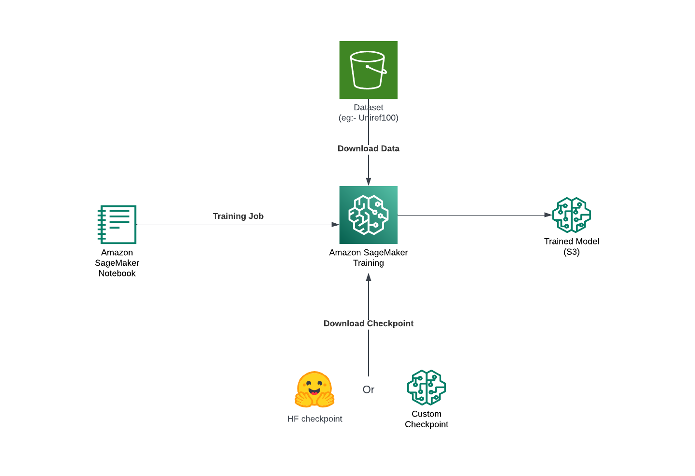
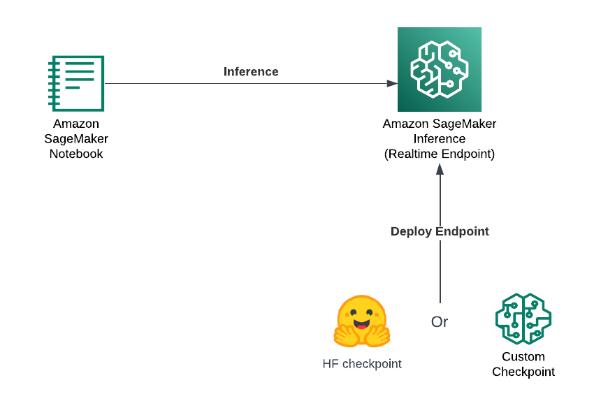

# Training and Deployment of AMPLIFY Models on Amazon SageMaker

This repository demonstrates how to train and deploy AMPLIFY models on AWS SageMaker.

SageMaker provides a managed infrastructure for training and deploying machine learning models at scale, with features that make it easier to manage, monitor, and optimize your models.

---

## What is Amazon SageMaker?

Amazon SageMaker is a fully managed machine learning service that provides every developer and data scientist with the ability to build, train, and deploy machine learning models quickly. It simplifies the process of building and deploying models by providing scalable resources, managed compute instances, and built-in support for various machine learning frameworks (e.g., TensorFlow, PyTorch, Hugging Face).

### Key Features of SageMaker:

- **Managed Infrastructure**: Automatically provisions and manages compute resources, scaling them according to the workload.
- **Flexible and Scalable**: Supports distributed training and model deployment, making it easy to handle large datasets and heavy computational needs.
- **Built-in Algorithms and Frameworks**: Provides pre-built algorithms, SDKs, and support for popular machine learning libraries.
- **Monitoring and Optimization**: Offers tools like SageMaker Debugger and SageMaker Model Monitor for debugging and monitoring models in production.

---

## SageMaker Architecture for Training and Inference

### 1. **Training Architecture**
- SageMaker Notebook is used to initiate the training job with necessary configurations such as instance type (CPU/GPU), training script, and hyperparameters.
- Based on the configurations provided in the SageMaker notebook, SageMaker dynamically provisions the cluster, including the necessary computing resources (CPU or GPU instances).
- The training data is stored in Amazon S3 and passed to SageMaker for training. 
- During the training, either a Hugging Face checkpoint (from the Hugging Face Hub) or a custom checkpoint (e.g., from MILA) is downloaded to initialize the model training.
- After training is complete, the resulting model artifacts (including the trained model and any generated checkpoints) are stored back in Amazon S3 for deployment.

### 2. **Inference Architecture**
- The trained model is deployed to a SageMaker endpoint for real-time inference, supporting both custom-trained models and models directly from the Hugging Face Hub.
- The model is served on instance types appropriate for the workload, such as GPU instances for large or complex models.
- The SageMaker endpoint is invoked via API requests, where input data is passed to generate predictions.

### Prerequisites:
AWS Account: You need an AWS account with permissions to create and manage SageMaker resources.
IAM Role: An IAM role with the necessary permissions for SageMaker, S3, and EC2.

